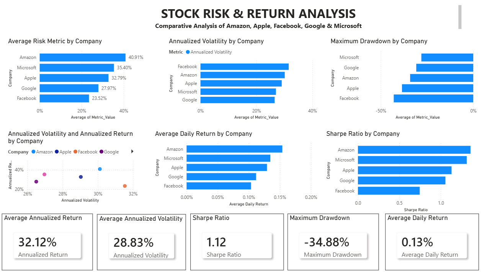

# 📊 Stock Risk & Return Analysis

An end-to-end financial data analytics project analyzing the historical risk and return characteristics of five major technology companies using **Python, SQL, Excel, and Power BI**.

---

## 📌 Project Overview

This project evaluates and compares the historical stock performance of:

- Amazon
- Apple
- Facebook (Meta)
- Google
- Microsoft

The analysis combines data preparation, financial calculations, SQL analysis, Python-based exploratory analysis, and an interactive Power BI dashboard to understand the relationship between **risk, return, and risk-adjusted performance**.

---

## 🎯 Business Objective

The objective is to compare the historical performance and risk characteristics of the selected companies using key financial metrics.

The analysis focuses on:

- Daily Returns
- Annualized Returns
- Annualized Volatility
- Sharpe Ratio
- Maximum Drawdown
- Trading Volume
- Closing Prices

> **Note:** The results describe historical performance in the supplied dataset and are not investment advice.

---

## 🛠️ Tools & Technologies

| Tool | Purpose |
|---|---|
| Python | Data cleaning, analysis, and financial calculations |
| Pandas | Data manipulation and analysis |
| NumPy | Numerical calculations |
| Matplotlib | Data visualization |
| SQL | Data querying and financial analysis |
| Excel | Data preparation and validation |
| Power BI | Interactive dashboard and visualization |
| Jupyter Notebook / Google Colab | Python analysis environment |

---

---

## 📊 Power BI Dashboard

The Power BI dashboard provides an interactive comparison of the historical risk and return characteristics of Amazon, Apple, Facebook, Google, and Microsoft.

### Dashboard Preview



### Key Metrics

- Average Annualized Return
- Annualized Volatility
- Sharpe Ratio
- Maximum Drawdown
- Average Daily Return

---

## 📁 Project Structure

```text
stock-risk-return-analysis/
│
├── Data/
│   └── FAANG_Combined_Data_Separated.xlsx
│
├── Python/
│   └── Stock_Risk_Return_Analysis.ipynb
│
├── SQL/
│   └── Stock_Risk_Return_Analysis.sql
│
├── PowerBI/
│   └── Dashboard975.png
│
└── README.md
